# Installing Oracle Registry on Home Assistant — walkthrough

A click-by-click record of installing and enabling the **Oracle Registry**
add-on on a real Home Assistant instance (HAOS), captured live with a browser
agent on 2026-08-29. Screenshot convention (`NN-name.png`, one state per shot)
follows the fleet's earlier walkthroughs.

> Note: on this instance the add-on was already installed by a prior session
> (v0.1.0, running since 2026-08-28, repo added via the Supervisor API). Every
> screen a fresh install passes through is still shown; steps already done are
> verified on-screen rather than re-clicked, so "Installed" badges appear where
> a fresh install would show an Install button.

## Things learned before the first click

- **HAOS serves the UI on port 80 after onboarding, not `:8123`.** On this host
  `:8123` has nothing listening. Use the plain hostname.
- HA 2026 renamed the add-on UI: `/hassio/*` URLs 404 silently — add-ons now
  live under **Settings → Apps** (`/config/apps`), and the CLI is `ha apps`.
- The first navigation to `/` bounces through `/auth/authorize`; a browser
  agent driving via CDP sees its inspected target die there. Reconnect and
  continue — it is a redirect, not a failure.
- HA has `ip_ban_enabled`: repeated failed logins ban the source IP. Never
  guess credentials against this form.
- Deep-linking `/config/apps/store` can render an empty shell; navigating
  Apps → **Install app** always works.

## Step 1 — Log in to Home Assistant

Open your Home Assistant URL. You land on the standard HA login form.

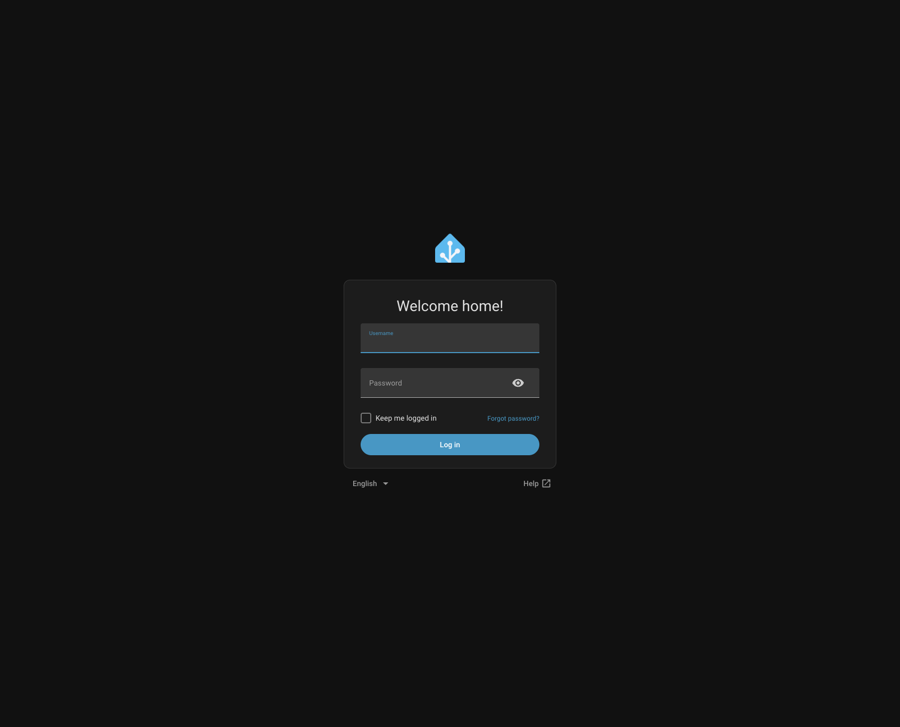

Enter username/password, tick **Keep me logged in**, press **Log in**.

## Step 2 — The dashboard

After login you land on **Overview**. If the add-on is already installed with
`Show in sidebar` on, **Oracle Registry** appears in the left sidebar.

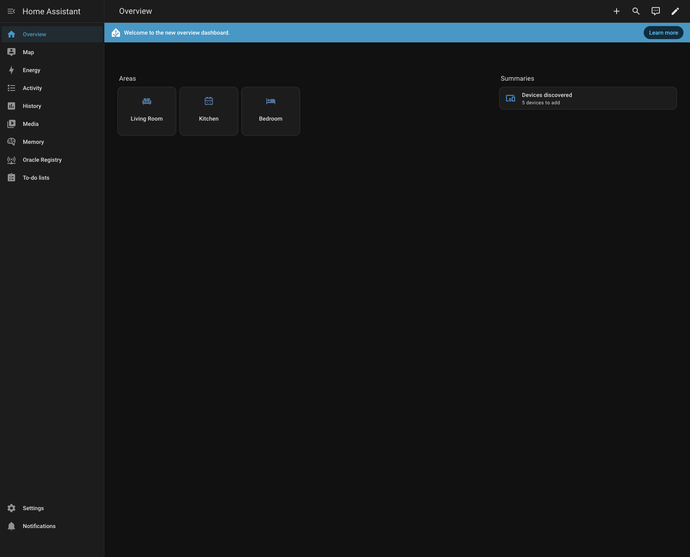

## Step 3 — Open the App store

**Settings → Apps**, then the **Install app** button (bottom right). The store
groups add-ons by repository — each third-party repo gets its own heading.

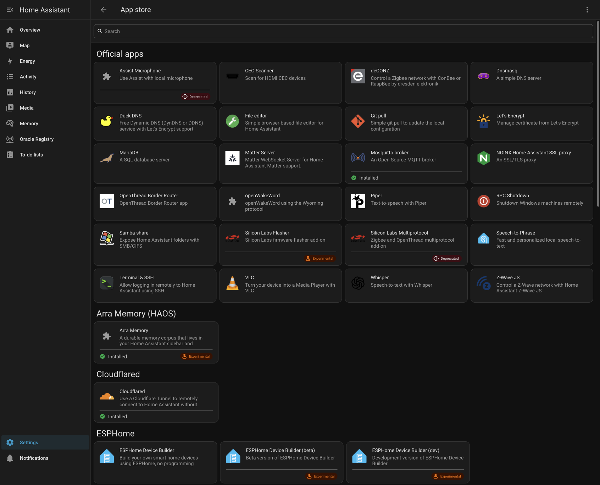

## Step 4 — Add the repository

Store **⋮ menu** (top right) → **Repositories**:

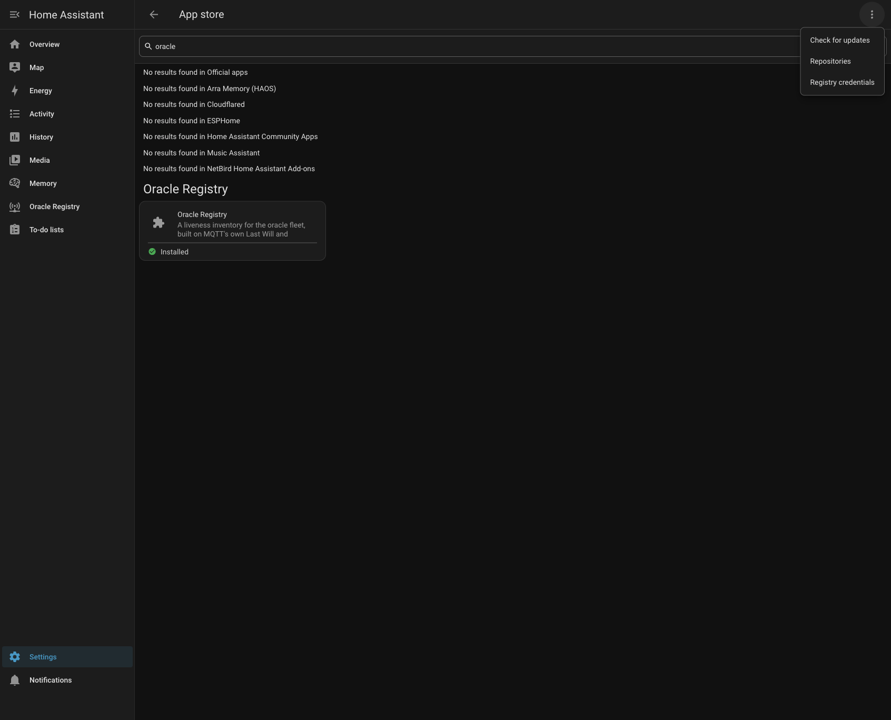

Press **Add** and paste:

```
https://github.com/Soul-Brews-Studio/oracle-registry-haos
```

After adding, the list shows the repo row — name, maintainer, URL. This row
existing is the proof the add succeeded:

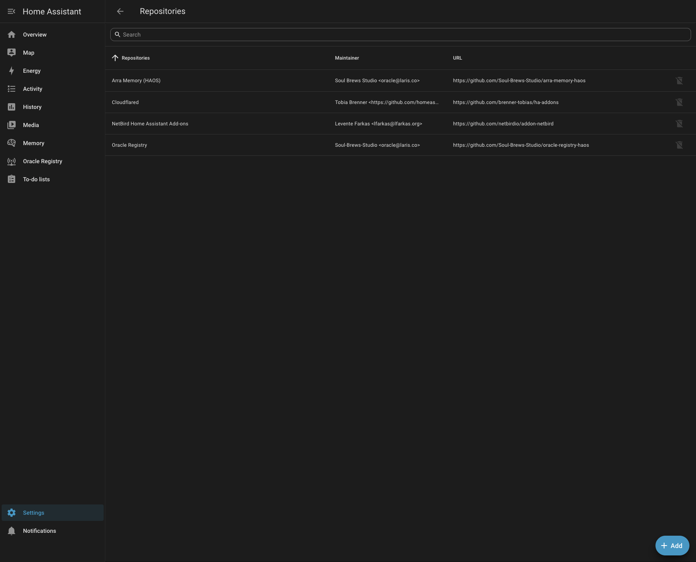

## Step 5 — Find the add-on

Search the store. The card appears under the repository's own **Oracle
Registry** heading — discovery working, not just a direct link:

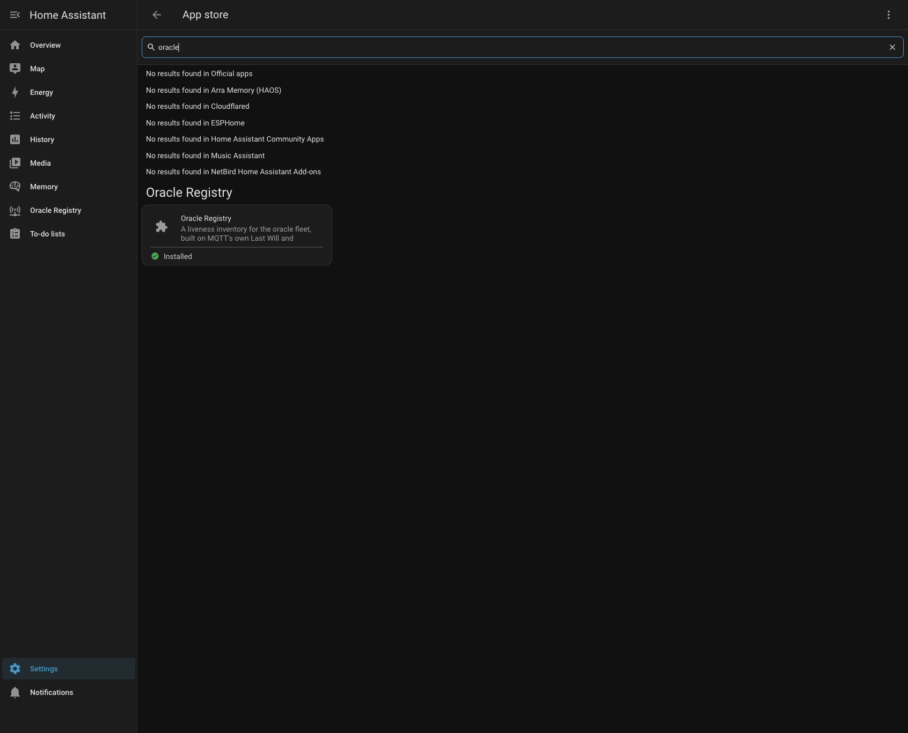

On a fresh install the card has no "Installed" badge; open it and press
**Install**.

## Step 6 — App detail: what a healthy install looks like

**Settings → Apps** shows the card as **Running** in the grid:

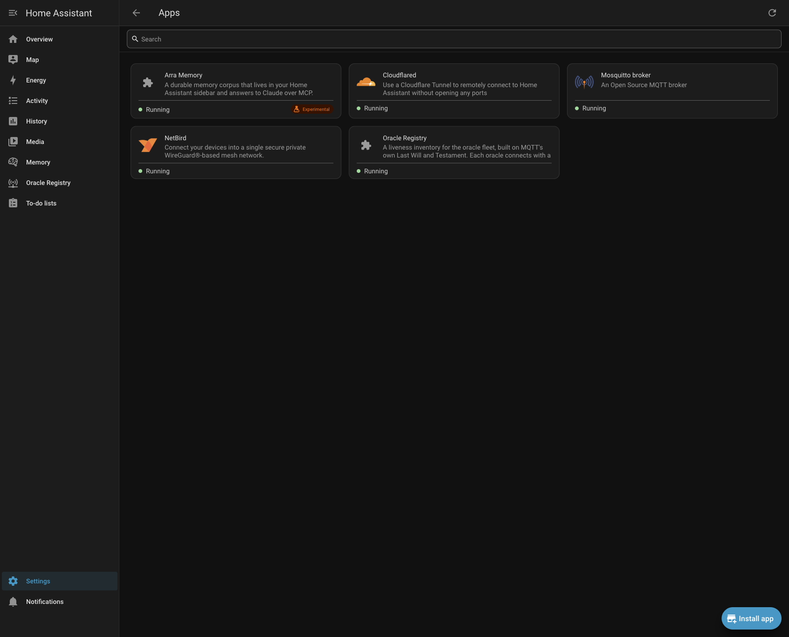

The add-on's **Info** tab shows version, the **Ingress** badge, controls, and
live resource usage:

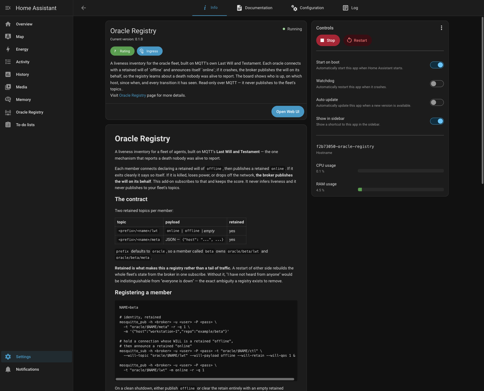

| item | value on this install |
|---|---|
| version | 0.1.0 |
| state | Running |
| start on boot / sidebar | on |
| CPU / RAM | 0.1% / 4.5% |

> ⚠️ The Info-page toggles (**Start on boot / Watchdog / Show in sidebar**)
> are live switches — they apply the moment you click, there is no Save.

## Step 7 — Configure the broker

**Configuration tab.** The password field renders masked. Defaults are correct
for a standard HAOS setup:

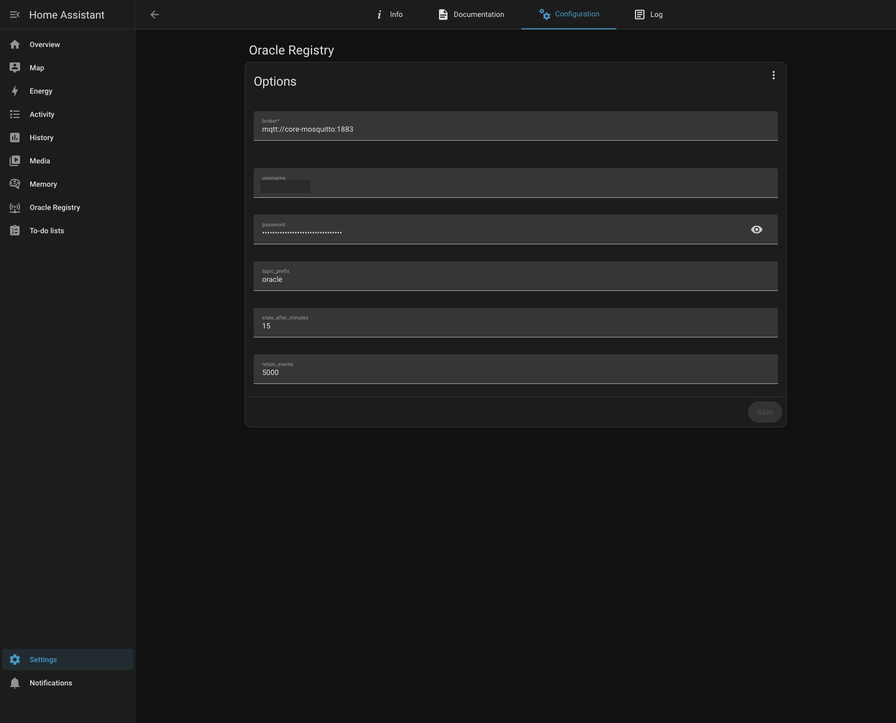

- `broker`: `mqtt://core-mosquitto:1883` — **hyphen**, not underscore. The
  slug `core_mosquitto` does not resolve as a hostname.
- `username`/`password`: a login that exists in the Mosquitto add-on's
  `logins:` list (Mosquitto ships with anonymous disabled).

Options apply on **restart of the add-on**, not on Save.

## Step 8 — The Log tab tells the whole enable story

This single screen shows every state the add-on can be in, in order:

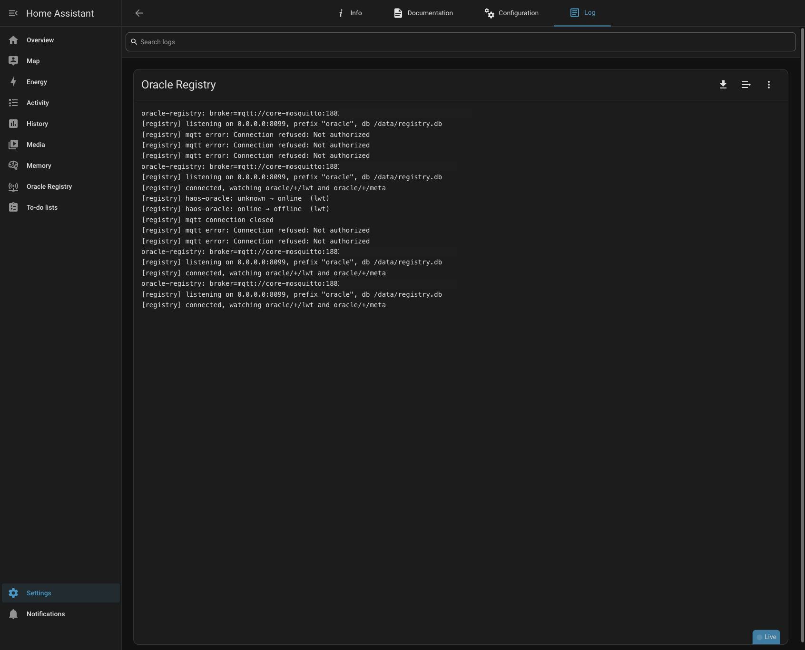

1. `user=<anonymous>` → `Connection refused: Not authorized` — Mosquitto
   rejects anonymous; a login must exist first.
2. Credentials set → `connected, watching oracle/+/lwt and oracle/+/meta` —
   **this line is the enable-proof.**
3. `haos-oracle: unknown → online (lwt)` then `online → offline (lwt)` — the
   registry receiving retained fleet state and recording transitions.

## Step 9 — Open the panel and see the fleet

Click **Oracle Registry** in the sidebar (or **Open Web UI** on Info). Ingress
means HA's own login covers it — no extra key needed.

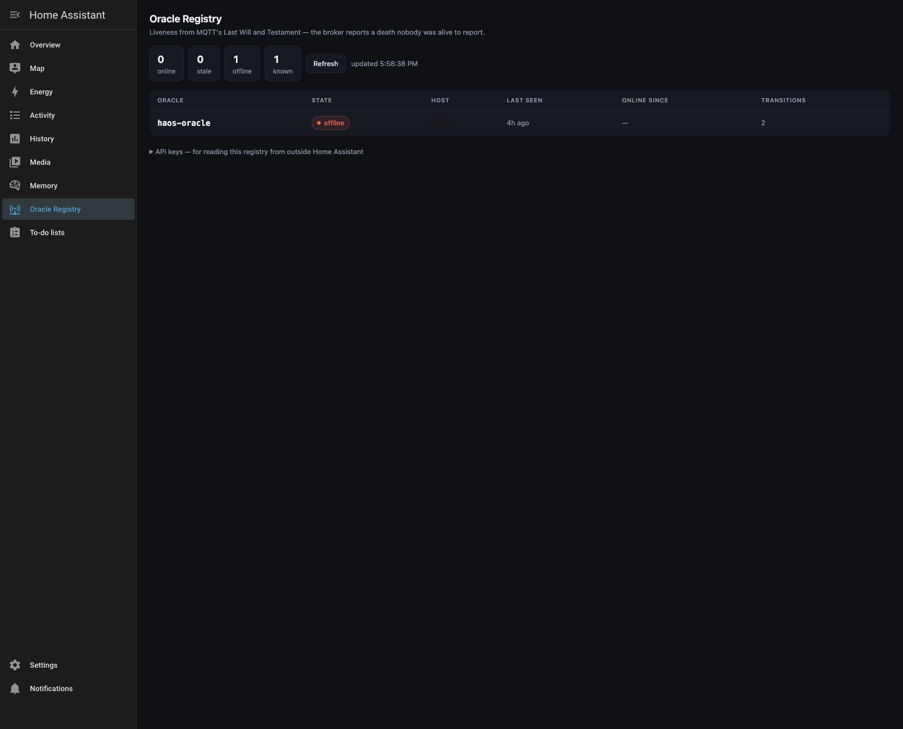

What this screen says, and why it is correct:

- **1 known, 1 offline** — the broker holds a retained `offline` for
  `haos-oracle`, published as its Last Will when its session died ~4h before
  this capture. Nobody was alive to report that death; the broker reported it.
  That is the entire point of the add-on.
- **2 transitions** — online → offline once each way; the events log keeps the
  history.
- **API keys** (collapsed at the bottom) — mint here, sidebar-only, for
  reading the registry from outside HA.

## Verification checklist

- [x] Repositories list shows the repo row
- [x] Store search finds the card under the repo's own heading
- [x] Settings → Apps lists Oracle Registry as **Running**
- [x] Log shows `connected, watching …/lwt and …/meta`
- [x] Sidebar panel loads through ingress without extra auth
- [x] Registry shows retained fleet state from the broker (not empty)
